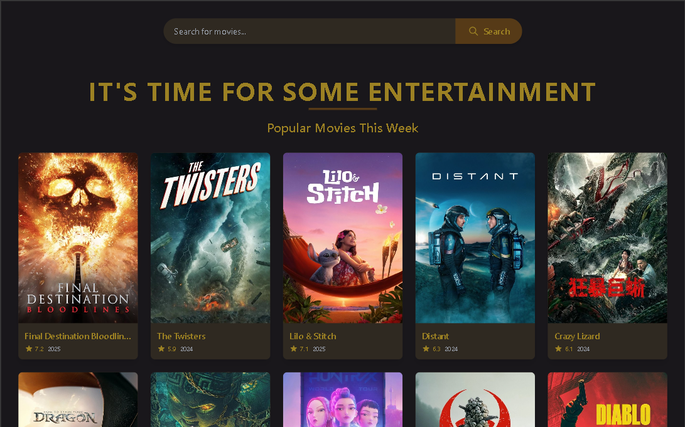

# 🎬 Movie Explorer Website

A responsive movie browsing app that allows users to explore trending films, view details, and discover new content. Built using React and Tailwind CSS with a dynamic UI and external movie API integration.

### 🔗 Live Demo
👉 [View Live Site](https://askweb17.netlify.app/)

---

## 🚀 Features

- Trending and top-rated movie listings
- Movie detail pages with posters, genre, release date, etc.
- Search functionality for titles
- Clean layout with scroll and hover effects
- Responsive design across devices

---

## 🧰 Tech Stack

- React
- Vite
- Tailwind CSS (CDN)
- TMDB API (or similar)

---

## 📸 Screenshots



## 📦 Getting Started

1. Clone the repo:
```bash
git clone https://github.com/abdulsalamkhan441/movie-website.git
